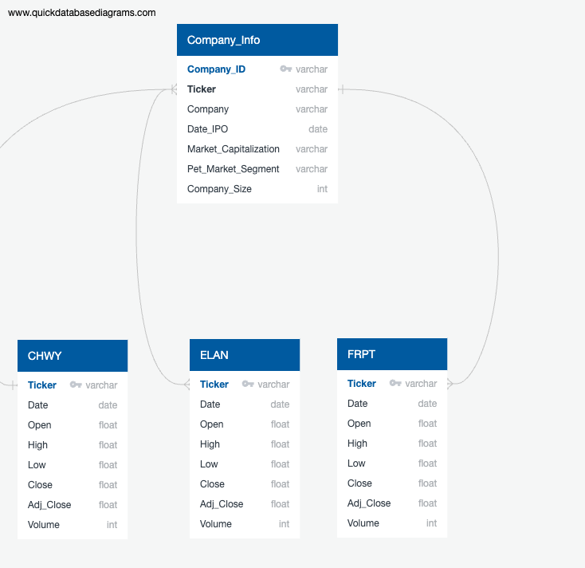
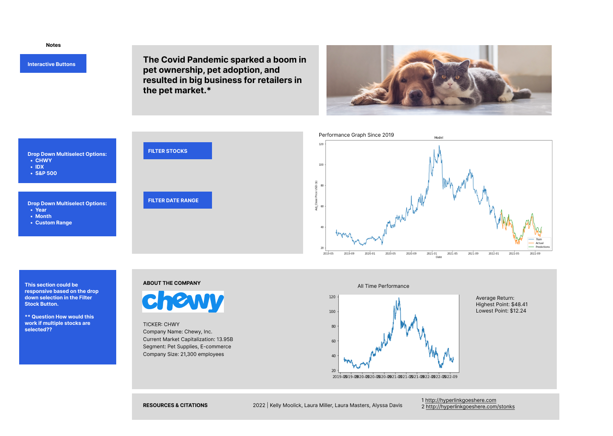

# Final_Project

## Topic Overview

In 2019 the Covid-19 pandemic spread worldwide. In attempt to minimize the spread of the virus, the USA went in to lockdown in March of 2020. Many Americans adopted pets, largely cats and dogs, to cope with the stress of being hope for such a long period of time during lockdown. How has this affected the stock market for large pet companies? We are looking at stock closing price data for multiple pet companies across 2019-2020 to determine how Covid-19 impacted this industry.  Our hypothesis is that the changes associated with working from home and mandatory closures corresponded to an increase in pet ownership and this would be reflected in the stock data as an increase in stock pricing when compared to previous years.  We selected stocks to show various sectors of this industry including veterinary services, pet food and treats, pet care products, online pet medication and supplements and veterinary diagnostic services. 

Goal: To develop a ML model to predict stock performance for this business sector and demonstrate how this industry thrived across this time period.  

## Presentation Slides
Here is a link to the draft presentation [slides](https://docs.google.com/presentation/d/1QxTAxMEOH4uQNyeQjTgOWfsjggnLrtuQdbM-eKRpzdk/).

## Communication Protocols
- biweekly video calls 
- google shared drive 
- Git repository
- dedicated Slack channel

## Project Flow

## Data Sources
Yahoo Finance Historical Data 
- [CHWY](https://finance.yahoo.com/quote/CHWY/history?p=CHWY)

ASPCA - https://www.aspca.org/about-us/press-releases/new-aspca-survey-shows-overwhelming-majority-dogs-and-cats-acquired-during

Washington Post - https://www.washingtonpost.com/business/2022/01/07/covid-dogs-return-to-work/

Pet data
- Insurance Information Institute
- American Pet Products Association
- American Veterinary Meidcal Association
- North American Pet Health Insurance Association

## Database

Entity Relationship Diagram (ERD)

## Visualizations
Below is a draft of what may be included in our final dashboard presentation. The plan is to utilize graphs from plotly and Seaborn for visuals, and create an interactive dashboard in a Tableau story or dashboard. There will be interactive elements as noted in the mockup to filter to specific stocks and date ranges to learn more.

## Machine Learning

Note: use the dates to divide the training and testing sets.  The training data should preceed the testing data.  Do this by using a conditional to define the test dataframe on dates.  

Long Short-Term Memory (LSTM) is a type of recurrent neural network is frequently applied for stock market prediction. Because it is able to store past information and prediction of future stock prices is dependent on previous prices, an LSTM model is useful because it can learn order dependence in sequence prediction problems.   

The data is loaded into the DataFrame as a Comma Separated Value (.csv) file. The data was then checked to view the datatypes and reformat columns for later processing. The features and target were defined using “y” and “x” respectively. The data was split into test and training data using scikit random_state parameter. The data was then scaled using StandardScaler. A Keras Sequential Model is activated which is ideal for plain stacks of layers. We then added the input and output layers to the model, with the output model using a probability activation function. The model was then compiled and customized before fitting the model to the training data. The model was then evaluated for accuracy.

## Summary

## Future Improvement

Since many of the pet stock sources were private, the data was limited to the ones that were available to the public through Yahoo! Finance. Due to this issue, some of the major pet companies such as PetCo and PetSmart were unable to be added to the analysis. These are multibillion-dollar companies that dominate the pet industry. If the stock information for these companies were added to the analysis, we would have a more accurate depiction of how well the pet industry did in the stock market in 2019. 
